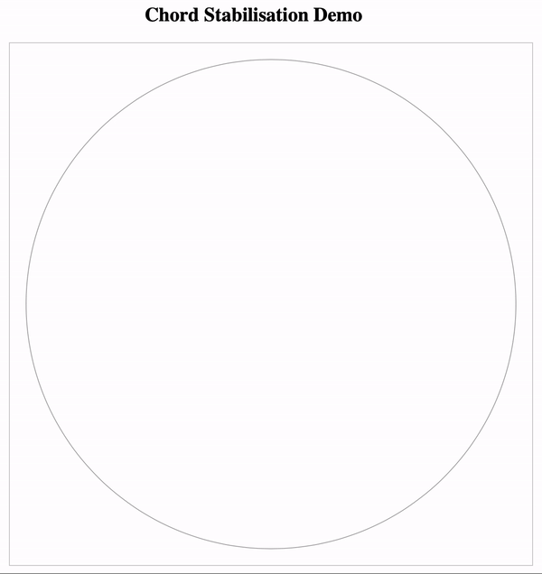

# Chort Distributed Hash Table 

## Overview ##

The goal of the project is to provide an efficient Chord distributed hash table implementation in Scala using Akka framework

## Modules ##

There are two modules: _core_ and _demo_

### Core ###

The _core_ module provides implementation of the service which should be running on every peer.

The implementation is based on the architecture described in the [Chord paper](https://pdos.csail.mit.edu/papers/ton:chord/paper-ton.pdf).

### Demo ###

_demo_ module provides a dht status monitor webserver which provides a REST API for the nodes to call in order to register their current status in the system.
Browser-based fronted demonstrates Chord stabilization process real-time.

## Running the Demo ##

Currently in order to start the demo you need to run both modules:
* the `Main.scala` from the _core_ module, which itself create multiple peer instances that join through a particular node and 
* the `WebServer.scala` from the _demo_ module which start the dht status monitor webserver.

The status can be monitored at `http://127.0.0.1:4567/websocket.html`

## Demo preview

## Frontend and Inspiration ##
html/js frontend is shamelessly taken from [this repo](https://github.com/tristanpenman/chordial)